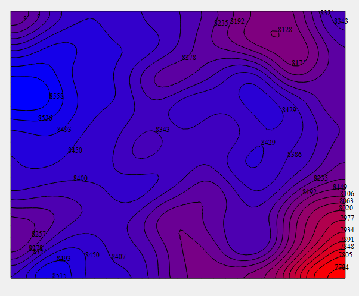

### 等值线自动建立拓扑关系算法与快速填充应用——学生时代的第一个练手项目，保存代码做留念
- 通过构建“拓扑包含二叉树”，找到了一种自动建立等值线拓扑关系的新方法，并且提出了一种基于拓扑关系的等值线图快速填充算法。
- 开发语言：算法实现用的c++，图像界面等可视化工作用的Qt5.9
- 运行环境要求：windows+vs2017+Qt5.9
- 参考论文：[《等值线自动建立拓扑关系算法与快速填充应用》](./Doc/等值线自动建立拓扑关系算法与快速填充应用.pdf)
- 运行效果：
  
