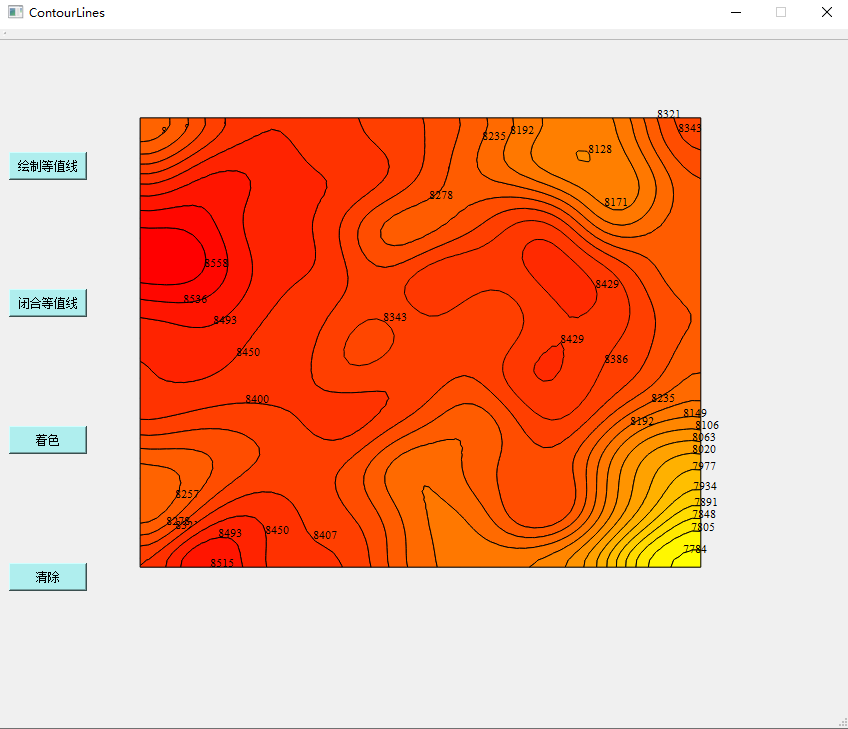
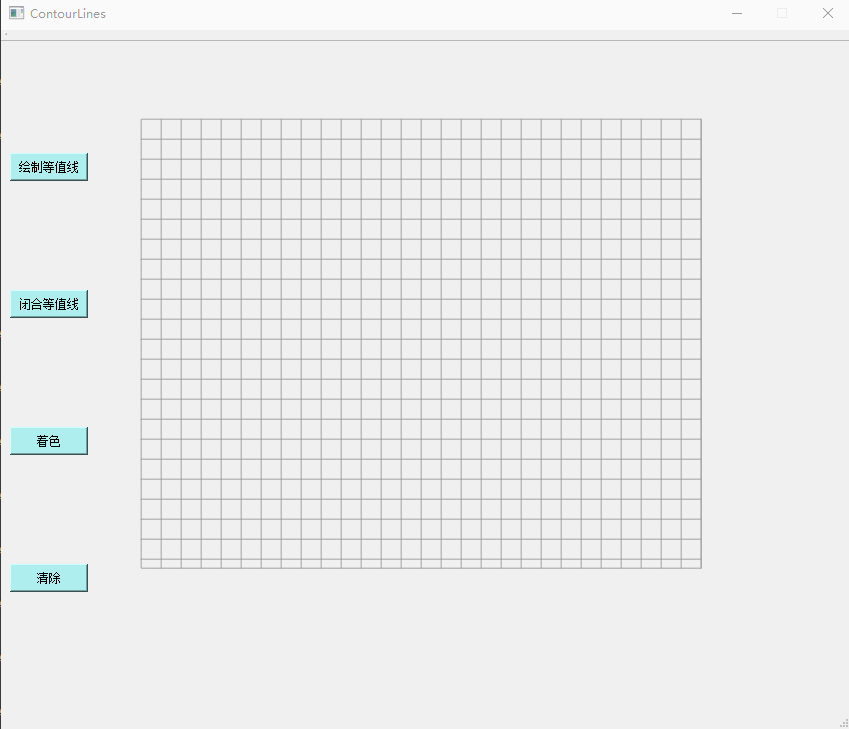

### 等值线自动建立拓扑关系算法与快速填充应用
- 通过构建“拓扑包含二叉树”，找到了一种自动建立等值线拓扑关系的新方法，并且提出了一种基于拓扑关系的等值线图快速填充算法。
- 开发语言：算法实现用的c++，图像界面等可视化工作用的Qt5.9
- 运行环境要求：windows+vs2017+Qt5.9
- 参考论文：[《等值线自动建立拓扑关系算法与快速填充应用》](./Doc/等值线自动建立拓扑关系算法与快速填充应用.pdf)
- 数据存放文件：[contourdata.txt](./ContourClose/contourdata.txt)
  - 数据格式说明：
    从左到右依次为等值线id号、等值线的值、等值线x坐标、等值线y坐标，中间以空格隔开（id value x y x y x y x y）。
  
  | 等值线id号 | 等值线的值 | 等值线x坐标 | 等值线y坐标 |
  | ---- | ----  | --- | --- |
  | 0 | 7784 | 18733362.25 | 3516908.91711954 | 18733168.255467 |
  
- 运行效果：
  

  
